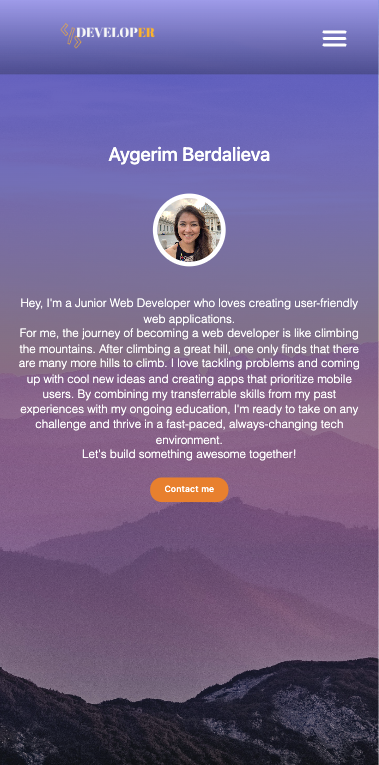
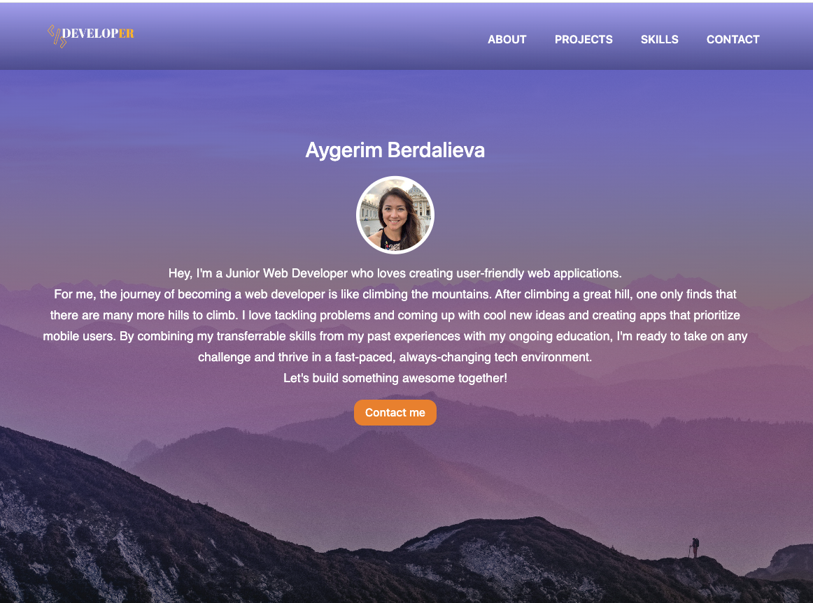

# React-Portfolio

A portfolio site using React Single Page Application.

### Github : https://github.com/AnaraB/portfolio

### Deployed site : https://portfolio.anara-berdalieva.co.uk/

## Description

A portfolio site using React.js Single Page Application to showcase the projects that I have done in edX Boot Camp and IT Career Switch.

## Usage

- This website has about me, projects, contact, and skills sections.
- A brief explanation of my professional experience on Skills page.
- Users can see my works on Projects page.
- Users also can send a message on Contact me.
- Displaying my skills on Skills page. Users are be able to download a PDF version of my CV and contact me via Linkedin or GitHub link provided.

## Screenshots

<!-- 
 -->

## Technologies Use

<a href="https://reactjs.org/">React</a>

<a href="https://nodejs.org/">Node.js</a>

<a href="https://getbootstrap.com/">Bootstrap</a>

<a href="https://www.npmjs.com/package/react-hook-form">React Hook Form</a>

<a href="https://www.npmjs.com/package/uuid">UUID</a>

<a href="https://maps-generator.com/">Maps-generator</a>

## Contributor:

Aygerim Berdalieva ©2024 All Rights Reserved.

---
